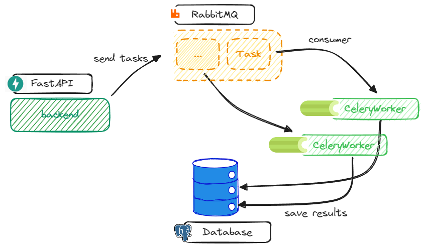

# Bemore

Bemore is a web application that helps you to keep up with the latest research in your field.

<p align="center">
<a href="https://github.com/AndPuQing/BeMore/actions/workflows/tests.yml"></a>
<a href="https://codecov.io/gh/AndPuQing/BeMore" >
 
 </a>
<a href="https://github.com/AndPuQing/BeMore/blob/main/LICENSE"></a>
<a href="https://github.com/psf/black"></a>
<a href="https://results.pre-commit.ci/latest/github/AndPuQing/BeMore/develop"></a>
</p>


## Structure


[](https://app.fossa.com/projects/git%2Bgithub.com%2FAndPuQing%2FBeMore?ref=badge_shield)


## TODO

- [x] Add docker-compose for development
- [ ] Add more paper sources(e.g. arxiv, AAAI, ICLR, etc.)
- [ ] Recommendation system
  - [x] User subscription api endpoint
  - [ ] User feedback api endpoint
  - [ ] recommend api endpoint
  - [ ] Recommendation algorithm
  - [ ] Base dataset for recommendation
- [ ] Admin panel
- [ ] Add tests
- [ ] Add CI/CD

## Development

### ~~Poetry~~
> [!CAUTION]
> Since we decided to use postgres database, the project can not longer be started from poetry run alone.

This project uses poetry. It's a modern dependency management
tool.

To run the project use this set of commands:

```bash
cd backend/app
poetry install
poetry run python -m app.main
```

This will start the server on the configured host.

You can find swagger documentation at `/api/docs`.

You can read more about poetry here: https://python-poetry.org/

### Docker(Recommended)

You can start the project with docker using this command:

```bash
docker compose up -d
```

If you want to develop in docker with autoreload add `-f docker-compose.dev.yml` to your docker command.
Like this:

```bash
docker compose -f docker-compose.dev.yml up -d
```

This command exposes the web application on port 8000, mounts current directory and enables autoreload.

But you have to rebuild image every time you modify `poetry.lock` or `pyproject.toml` with this command:

```bash
docker compose -f docker-compose.dev.yml up -d --build
```


## Configuration

This application can be configured with environment variables.

You can create `.env` file in the root directory and place all
environment variables here.


For example if you see in your "backend/app/app/core/config.py" a variable named like
`random_parameter`, you should provide the "RANDOM_PARAMETER"
variable to configure the value. This behaviour can be changed by overriding `env_prefix` property
in `bemore.settings.Settings.Config`.

An example of .env file:
```bash
RELOAD="True"
PORT="8000"
ENVIRONMENT="dev"
```

You can read more about BaseSettings class here: https://pydantic-docs.helpmanual.io/usage/settings/

## Pre-commit

To install pre-commit simply run inside the shell:
```bash
pre-commit install
```

pre-commit is very useful to check your code before publishing it.
It's configured using .pre-commit-config.yaml file.

By default it runs:
* black (formats your code);
* isort (sorts imports in all files);
* flake8 (spots possible bugs);
* ruff (formats your code);


You can read more about pre-commit here: https://pre-commit.com/


## ~~Running tests~~

## Star History

[](https://star-history.com/#AndPuQing/BeMore&Date)


## License
[](https://app.fossa.com/projects/git%2Bgithub.com%2FAndPuQing%2FBeMore?ref=badge_large)
